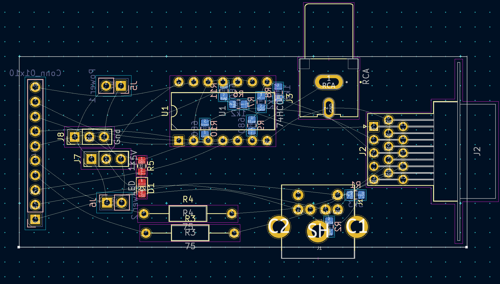
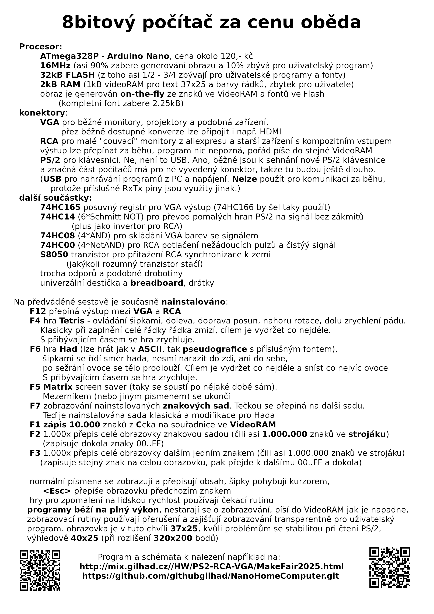
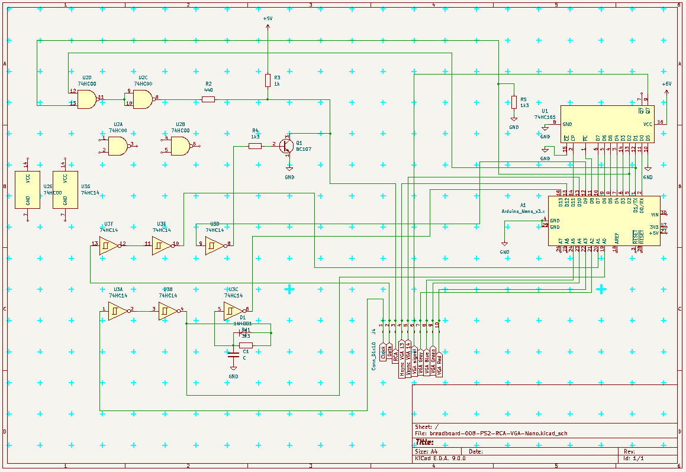
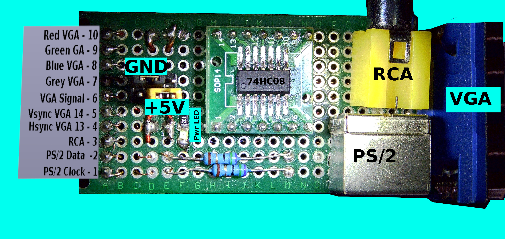
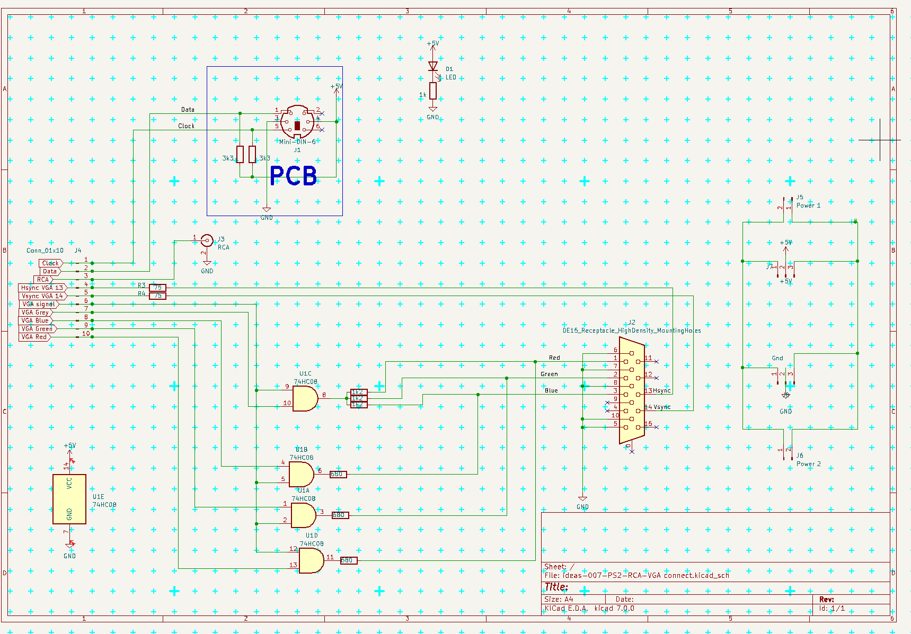

.. vim: set ft=rst noexpandtab fileencoding=utf-8 nomodified   wrap textwidth=0 foldmethod=marker foldmarker={{{,}}} foldcolumn=4 ruler showcmd lcs=tab\:|- list tabstop=8 noexpandtab nosmarttab softtabstop=0 shiftwidth=0 linebreak showbreak=»\

.. |Ohm| raw:: html

	Ω

.. |kOhm| raw:: html

	kΩ

Tento projekt najdete na  `<http://mix.gilhad.cz//HW/PS2-RCA-VGA/MakeFair2025.html>`__

Nano Home Computer 2.7
--------------------------------------------------------------------------------

Arduino Nano a pár běžných součástek zvládá generovat buď VGA, nebo kompozitní signál, přitom číst PS/2 klávesnici a ještě provádět nějaký program (Tetris, Matrix, Hada ...).

Tento projekt vznikl jako snaha zjistit, co ještě jde s Arduino Nano dokázat a jak takové záležitosti vůbec vypadají a jednak jako jeden z podprojektů na stavbu počítače **Comp24**, který měl zjistit, zda by touto cestou šlo udělat grafickou kartu k 8bitovému počítači a jak by to asi vypadalo.

Hardware
*********

VGA
++++

Prvním krokem bylo nějak zajistit fyzické připojení konektorů pro VGA monitor, kompozitní monitor (RCA) a PS/2 klávesnici - to bylo zrealizováno na univerzální destičce a ta byla vybavena i piny pro snadné osazení na breadboard. Přepínače napájení ji umožňují připojit bez ohledu na jeho polaritu - ta jde nastavit na dvou jumperech u breadboardu. Že je připojena správně se pozná podle LED na ní umístěné.

	|conectors.jpg|

	|conectorsSchema.png|

Výstup na VGA je řízen pomocí pinů Hsync, Vsync a VGA Signál jako "jednoduchý" černobílý obraz.
Pro ovládání barev na VGA slouží vstupy Red, Green, Blue a Gray, které nastavují, jakou barvu má popředí, ale z výkonových důvodů je atmega328P nastavuje jen na začátku řádky znaků, takže všechny znaky na řádce mají stejnou barvu.
Pro správnou funkci je potřeba během každých 8 cyklů procesoru vystavit dalších 8bitů obrazu, takže moc volnosti k vylepšování už není.

Zde je schema breadboardu kde je vidět, že signál jde paralelně jako byte přez celý port B a je následně převeden do sériové podoby pomocí shift-registru **74HC165** (šlo by použít i 74HC166, ale ten jsem doma neměl). Jako zdroj hodin slouží pin D8, na který je přiveden hodinový signál krystalu pomocí správně nastavených fuses.

	|breadboard-008-PS2-RCA-VGA-Nano.png|

RCA
++++

Po přepnutí na RCA se naopak signál generuje pomocí vnitřního UART taktovaného na maximální rychlost, tedy na polovinu frekvence procesoru.
Pro dosažní patřičných napěťových úrovní (0V pro synchronizaci, 0.3V pro černou barvu a 1.0V pro barvu bílou) byl navržen oporový dělič R2 (440 |Ohm| ) R3 (1 |kOhm|) a odpor vlastního vstupu (standardních 75 |Ohm|). Tím se pro logickou nulu na výstupu dostanou 0.3V a pro logickou jedničku 1.0V. Pro dosažení 0V je použit tranzistor Q1.
Protože UART vysílá na začátku jeden pulz a po skončení výstup odpojí (a tedy na něm není žádný signál), bylo nutno potlačit výstup pomocí hradla AND realizovaného 1/2 **74HC00**.

PS/2
+++++

Z důvodu relativně pozvolných hran PS/2 signálu je tento veden přez Schmitt hradla **74HC14** a zároveň je z něj odvozena obálka hodin přivedená na D13 - mimo tuto obálku nenní třeba data sledovat vůbec. Také může být použita pro zajištění, že pokud nějaký hodinový pulz není rozpoznán, tak se tato chyba nebude převádět do dalších datových rámců.

Strana 1
--------------------------------------------------------------------------------

.. |title2.png| image:: title2.png
	:width: 250
	:align: top
	:target: title2.png

|title2.png| |Strana2.png| |github-NanoHomeComputer.png| |MIX-MakerFair.png|

Strana 2
--------------------------------------------------------------------------------

8bitový počítač za cenu oběda
******************************

* **Procesor**:
	* **ATmega328P** - **Arduino Nano**, cena okolo 120,- kč
	* **16MHz** (asi 90% zabere generování obrazu a 10% zbývá pro uživatelský program)
	* **32kB FLASH** (z toho asi 1/2 - 3/4 zbývají pro uživatelské programy a fonty)
	* **2kB RAM** (1kB videoRAM pro text 37x25 a barvy řádků, zbytek pro uživatele)
	* obraz je generován **on-the-fly** ze znaků ve VideoRAM a fontů ve Flash (kompletní font zabere 2.25kB)
* **konektory**:
	* **VGA** pro běžné monitory, projektory a podobná zařízení, přez běžně dostupné konverze lze připojit i např. HDMI
	* **RCA** pro malé "couvací" monitory z aliexpresu a starší zařízení s kompozitním vstupem
	* výstup lze přepínat za běhu, program nic nepozná, pořád píše do stejné VideoRAM
	* **PS/2** pro klávesnici. Ne, není to USB. Ano, běžně jsou k sehnání nové PS/2 klávesnice a značná část počítačů má pro ně vyvedený konektor, takže tu budou ještě dlouho.
	* (**USB** pro nahrávání programů z PC a napájení. **Nelze** použít pro komunikaci za běhu, protože příslušné RxTx piny jsou využity jinak.)
* **další součástky**:
	* **74HC165** posuvný registr pro VGA výstup (74HC166 by šel taky použít)
	* **74HC14** (6*Schmitt NOT) pro převod pomalých hran PS/2 na signál bez zákmitů (plus jako invertor pro RCA)
	* **74HC08** (4*AND) pro skládání VGA barev se signálem
	* **74HC00** (4*NotAND) pro RCA potlačení nežádoucích pulzů a čistýý signál
	* **S8050** tranzistor pro přitažení RCA synchronizace k zemi (jakýkoli rozumný tranzistor stačí)
	* trocha odporů a podobné drobotiny
	* univerzální destička a **breadboard**, drátky

Na předváděné sestavě je současně **nainstalováno**:
	* **F12** přepíná výstup mezi **VGA** a **RCA**
	* **F4** hra **Tetris** - ovládání šipkami, doleva, doprava posun, nahoru rotace, dolu zrychlení pádu. Klasicky při zaplnění celé řádky řádka zmizí, cílem je vydržet co nejdéle. S přibývajícím časem se hra zrychluje.
	* **F6** hra **Had** (lze hrát jak v **ASCII**, tak **pseudografice** s příslušným fontem), šipkami se řídí směr hada, nesmí narazit do zdi, ani do sebe, po sežrání ovoce se tělo prodlouží. Cílem je vydržet co nejdéle a sníst co nejvíc ovoce. S přibývajícím časem se hra zrychluje.
	* **F5** **Matrix** screen saver (taky se spustí po nějaké době sám). Mezerníkem (nebo jiným písmenem) se ukončí
	* **F7** zobrazování nainstalovaných **znakových sad**. Tečkou se přepíná na další sadu. Teď je nainstalována sada klasická a modifikace pro Hada
	* **F1** zápis **10.000** znaků z **C**\čka na souřadnice ve **VideoRAM**
	* **F2** 1.000x přepis celé obrazovky znakovou sadou (čili asi **1.000.000** znaků ve **strojáku**) (zapisuje dokola znaky 00..FF)
	* **F3** 1.000x přepis celé obrazovky dalším jedním znakem (čili asi 1.000.000 znaků ve strojáku) (zapisuje stejný znak na celou obrazovku, pak přejde k dalšímu 00..FF a dokola)
	* normální písmena se zobrazují a přepisují obsah, šipky pohybují kurzorem, <Esc> přepíše obrazovku předchozím znakem
	* hry pro zpomalení na lidskou rychlost používají čekací rutinu (interně vázanou na začátek obrazovky, ale to je jedno, jen to zajišťuje pravidelnost)
	* programy běží na **plný výkon**, nestarají se o zobrazování, píší do **VideoRAM** jak je napadne, zobrazovací rutiny používají **přerušení** a zajišťují zobrazování **transparentně** pro uživatelský program.
	* obrazovka je v tuto chvíli **37x25**, kvůli problémům se stabilitou při čtení PS/2, výhledově **40x25** (při rozlišení **320x200** bodů)

Program a schémata k nalezení například na  `<http://mix.gilhad.cz//HW/PS2-RCA-VGA/MakeFair2025.html>`__ a `<https://github.com/githubgilhad/NanoHomeComputer.git>`__

